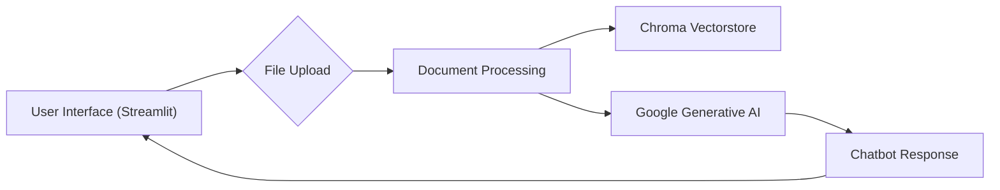

## RaDoG: Personalized AI Chatbot with Document Processing

This repository houses the code for RaDoG, a Streamlit application that empowers users to interact with a personalized AI chatbot. This chatbot leverages the power of Google Generative AI to answer questions based on the content of uploaded documents. 

## Overview

RaDoG provides a user-friendly interface for interacting with a chatbot that understands the content of your documents. Users can upload various file formats (text, PDF, DOCX) and engage in conversations with the chatbot, receiving contextually relevant answers. The application is built using Streamlit for its intuitive web interface and leverages powerful tools like Google Generative AI for embedding, text generation, and Chroma for efficient document retrieval.

## Core Features

* **Document Upload:** Users can upload various file formats (text, PDF, DOCX).
* **AI-Powered Chatbot:** Engage in conversations with the chatbot and receive contextually relevant answers.
* **Document Processing:** The application processes uploaded documents using Google Generative AI to extract relevant information.
* **Vectorstore for Efficient Retrieval:** Chroma is used to create a vectorstore that enables the chatbot to retrieve the most relevant document content for each user query.

## Architecture

The application's architecture follows a layered approach, with the Streamlit interface handling user interaction, the document processing logic handling file uploads and vectorstore creation, and Google Generative AI providing text generation and embedding capabilities.



## Technology Stack

* **Front-end:** Streamlit
* **AI/Text Processing:** Google Generative AI API
* **Vectorstore:** Chroma
* **Document Processing:** PyPDF2, docx2txt
* **Language:** Python
* **Other Libraries:** `dotenv`, `langchain`, `langchain_community`, `langchain_google_genai`

## Development Environment Setup

1. **Install Python:** Ensure you have a Python 3.x interpreter installed.
2. **Create a Virtual Environment:**  
    ```bash
    python -m venv venv-test
    source venv-test/bin/activate 
    ```
3. **Install Dependencies:**
    ```bash
    pip install -r requirements.txt
    ```
4. **Configure Google Generative AI API:**
    - Obtain an API key from the Google Cloud Platform console.
    - Set the API key as an environment variable.
    - See [https://cloud.google.com/generative-ai/docs/quickstart](https://cloud.google.com/generative-ai/docs/quickstart) for instructions.
5. **Run the Application:**
    ```bash
    streamlit run app.py
    ```

## Testing

The application currently does not include unit tests. Future development may include comprehensive testing using frameworks like pytest.

## Deployment

For deployment, consider using services like Streamlit Sharing or a custom server setup. The deployment process will involve:

1. **Packaging the application:** Ensure that all dependencies are correctly included.
2. **Configuring the environment:** Set up necessary environment variables (Google Generative AI API key).
3. **Deployment to a server:** Choose a deployment platform and follow their specific instructions.

## Performance Considerations

For optimized performance, consider:

* **Vectorstore Indexing:** Use appropriate indexing strategies within Chroma for efficient retrieval.
* **Caching:** Implement caching mechanisms for repeated API requests to Google Generative AI.
* **Resource Management:** Optimize the application's memory usage and resource allocation.

## Security Considerations

* **API Key Management:** Securely store the Google Generative AI API key in a protected environment (environment variables).
* **Input Validation:** Implement robust input validation to prevent potential vulnerabilities like SQL injection or cross-site scripting.
* **Data Security:** Ensure sensitive data (user uploads) is handled securely.

## Contribution Guidelines

Contributions to this project are welcome!

1. **Fork the repository:** Create a fork of this repository on your GitHub account.
2. **Create a branch:** Create a new branch for your changes.
3. **Make your changes:** Implement your feature or fix.
4. **Test your changes:** Ensure your changes do not introduce new bugs.
5. **Submit a pull request:** Submit a pull request to the main repository, clearly explaining your changes.

## License

This project is licensed under the MIT License.

## Acknowledgements

This project utilizes various open-source libraries and APIs, including Google Generative AI, Streamlit, Chroma, PyPDF2, and docx2txt. We acknowledge and appreciate the contributions of these projects.

## Contact

For any questions or suggestions, please contact the project maintainers.

---

This README provides a comprehensive overview of RaDoG, including its architecture, features, setup instructions, and guidelines for contributions. As the project evolves, this document will be updated to reflect the latest changes. 
